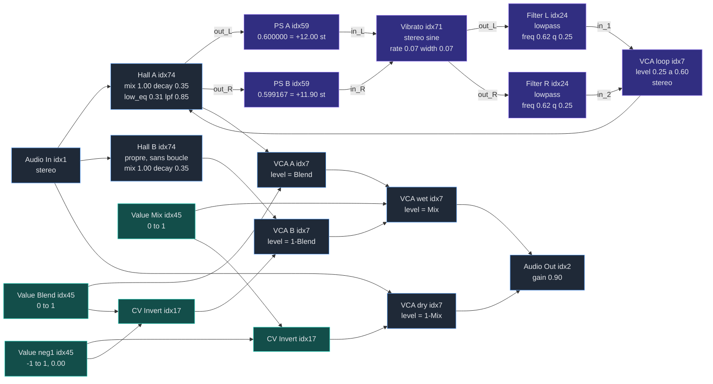

# Shimmer Reverb — ZOIA

Pitch shift **dans** la boucle du reverb. Boucle stéréo, un shifter par canal.



Violet = la boucle shimmer. Bleu = chemin audio. Vert = les contrôles.
Toutes les connexions audio à 100%.

Deux Hall en parallèle sur la même entrée : **A** porte la boucle shimmer, **B** reste
propre. Le `Blend` crossfade les deux, le `Mix` crossfade ce résultat contre le dry.
Ça reproduit la face avant du MkII : Mix et Blend deviennent vraiment indépendants.

## Deux faits qui contraignent le montage

**Le VCA ne peut pas amplifier.** Son `level_control` va de `-inf` à **0 dB**, l'unité
est le maximum. Donc le VCA seul ne peut jamais faire diverger la boucle : tout runaway
vient du decay interne du Hall ou du gain propre du Pitch Shifter, pas de lui. Et son
défaut est `0` = `-inf` = **muet** : un VCA fraîchement posé ne passe rien.

**Le Hall Reverb n'a aucune option.** 8 blocs figés, stéréo obligatoire. Impossible de
le passer en mono pour économiser du CPU, contrairement au Vibrato ou au VCA.

## Modules — options et params

| module | idx | cpu | blocs | options |
|---|---|---|---|---|
| Audio Input | 1 | 0.30 | 1-2 | `channels` stereo / left / right |
| Audio Output | 2 | 1.00 | 1-3 | `gain_control` off / **on** · `channels` stereo / left / right |
| Hall Reverb | 74 | 17.00 | 8 | aucune |
| Pitch Shifter | 59 | 15.10 | 3 | aucune — mono only |
| Vibrato | 71 | 4.10 | 4-6 | `channels` 1in->1out / 1in->2out / **stereo** · `control` **rate** / tap_tempo / cv_direct · `waveform` **sine** / triangle / swung_sine / swung |
| Multi Filter | 24 | 0.80 | 4-5 | `filter_shape` **lowpass** / hi_shelf / bell / highpass / low_shelf / bandpass |
| VCA | 7 | 0.30 | 3-5 | `channels` 1in->1out / **stereo** |
| Value | 45 | 0.15 | 2 | `output` **0 to 1** / -1 to 1 |
| CV Invert | 17 | 0.02 | 2 | aucune |

En gras l'option retenue ici. Le `gain` du Multi Filter est le 5ᵉ bloc, non-default :
il faut passer le module de 4 à 5 blocs pour l'exposer.

| param | module | défaut | unité | range | réglage retenu |
|---|---|---|---|---|---|
| `decay_time` | Hall | 0.50 | s | 0 / 2.62 / 4.12 / 8.6 / inf | **0.35** |
| `mix` | Hall | 0.50 | % | 0 .. 100 | **1.00** |
| `low_eq` | Hall | 0.50 | dB | -8 .. 8 | **0.31** = -3 dB |
| `lpf_freq` | Hall | 0.50 | Hz | 1700 / 2450 / 3200 / 3950 / 4700 | **0.85** |
| `pitch_shift` | PS | 0.50 | semitones | -60 .. 60 | **0.600000** / **0.599167** |
| `rate` | Vibrato | 0.50 | Hz | 0 / 1.53 / 5.4 / 15.2 / 40 | **0.07** |
| `width` | Vibrato | 0.50 | — | 0 .. 1 | **0.07** |
| `direct` | Vibrato | 0 | — | 0 .. 1 | inutilisé, sert si `control` = cv_direct |
| `gain` | Multi Filter | 0.50 | dB | -40 .. 40 | non exposé |
| `frequency` | Multi Filter | 0.50 | Hz | 28 / 158 / 880 / 4978 / 23999 | **0.62** = 2 kHz |
| `q` | Multi Filter | 0.28 | — | 0.1 / 0.6 / 3.2 / 17.8 / 100 | **0.25** |
| `level_control` | VCA | 0 = mute | dB | -inf / -12 / -6 / -2.5 / 0 | loop **0.25-0.60** · A = Blend · B = 1-Blend · wet = Mix · dry = 1-Mix |
| `value` | Value | 0 | — | 0 .. 1 | Mix **0.50** · Blend **0.50** · neg1 **0.00** |
| `gain` | Audio Output | 0.83 | dB | -100 / -70 / -40 / -10 / 20 | **0.90** |

`decay_time` = le corps qui reste à hauteur. `VCA loop` = la vitesse de montée.
`mix 1.00` empêche le dry d'entrer dans la boucle et de se faire transposer.
La stabilité vient du **filtre** : le pitch shift pousse l'énergie là où le lowpass
coupe, donc la boucle converge d'elle-même.

## Face avant de l'Immerse

Noms et libellés exacts du manuel MkII.

| bouton MkII | libellé constructeur | ZOIA | câblé |
|---|---|---|---|
| Mix | *adjusts the blend of dry signal to effect, 100% dry to 100% effect* | `Value Mix` → `VCA wet`, et `1 - Mix` → `VCA dry` | oui |
| Depth | *controls the reverb depth, also called decay time* | `Hall decay_time`, bloc 2 | non |
| Time/Tone | *adjusts the effect tone* | `frequency` des deux Multi Filter, un Value commun | non |
| Pre-dly/Mod/Blend | en mode Shimmer : *controls the mix between the reverb and shimmer effects* | `Value Blend` → `VCA A`, et `1 - Blend` → `VCA B` | oui |
| Kill Dry | sortie 100% effet | `VCA dry` à 0 | acquis |

Le dry/wet s'appelle **Mix**, pas Blend. « Blend » désigne le 4ᵉ bouton, dont la
fonction change selon le mode :

| mode | Time/Tone | Pre-dly/Mod/Blend |
|---|---|---|
| W3T, Plate | tone | pre-delay |
| Hall | tone | profondeur de modulation |
| Spring | tone | vitesse de modulation |
| Sustain | Hold time | profondeur de modulation |
| Echo | delay time | blend reverb / echo |
| Detune | tone | blend reverb / detune |
| Shimmer | tone | mix reverb / shimmer |

À noter : en mode Hall ce bouton pilote la profondeur de modulation, ce qui est le rôle
de notre Vibrato. Il est donc moins optionnel qu'il n'y paraît dans leur conception.

Le libellé « mix between the reverb and shimmer effects » est pris au mot ici : deux
reverbs parallèles, vrai crossfade. Le `VCA loop` devient alors un réglage interne — la
quantité de shimmer *généré* dans la branche A — et non plus le blend lui-même.

Variante moins chère : `Reverb Lite` idx79 (6.5) à la place du Hall B. On perd `lpf_freq`
et `low_eq` sur la branche propre, mais elle ne sert qu'à fournir l'extrémité « sans
shimmer » du Blend, donc son timbre exact importe peu. Économie de 10.5 points.

Le MkII n'a qu'un mode Shimmer. Le MkI en avait deux, A et B, fusionnés depuis.

## Absent de ZOIA

| manque | contournement |
|---|---|
| `mix` sur le Pitch Shifter | aucun, d'où le dosage au VCA |
| Pitch Shifter stéréo | mono only, 2 modules |
| Multi Filter stéréo | mono only, 2 modules |
| Hall mono | aucune option, stéréo imposé |
| pre-delay sur le Hall | `Buffer Delay` idx26 (0.2, 0-16 samples) ou `Delay Line` idx13 (2.0, max_time 100ms) |
| `lpf_freq` > 4700 Hz | impossible, ce Hall est sombre par nature |
| gain > unité sur un VCA | max 0 dB, il faut un autre étage pour amplifier |
| force de connexion en CV | figée dans le patch |
| crossfade dry/wet natif | 2 VCA + Value + CV Invert |

## CPU

```
Hall A             17.00
Hall B             17.00
2 Pitch Shifters   30.20
Vibrato stereo      4.10   optionnel
2 Multi Filters     1.60
5 VCA               1.50
3 Value             0.45
2 CV Invert         0.04
Audio In            0.30
Audio Out           1.00
                   -----
                   73.19

Hall B remplacé par Reverb Lite      62.69
un seul Hall, Blend croisé au decay  55.44
sans le Vibrato                      -4.10 dans les trois cas
```

## Blocs, positions canoniques

```
Audio Input    0 output_L   1 output_R
Audio Output   0 input_L   1 input_R   2 gain
Hall Reverb    0 in_L   1 in_R   2 decay_time   3 mix   4 out_L   5 out_R   6 low_eq   7 lpf_freq
Pitch Shifter  0 audio_in   1 pitch_shift   2 audio_out
Vibrato        0 in_L   1 in_R   2 rate   3 tap_tempo_in   4 direct   5 width   6 out_L   7 out_R
Multi Filter   0 audio_in   1 gain   2 frequency   3 q   4 audio_out
VCA            0 in_1   1 in_2   2 level_control   3 out_1   4 out_2
Value          0 value   1 cv_output
CV Invert      0 cv_input   1 cv_output
```
