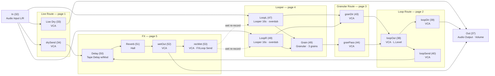
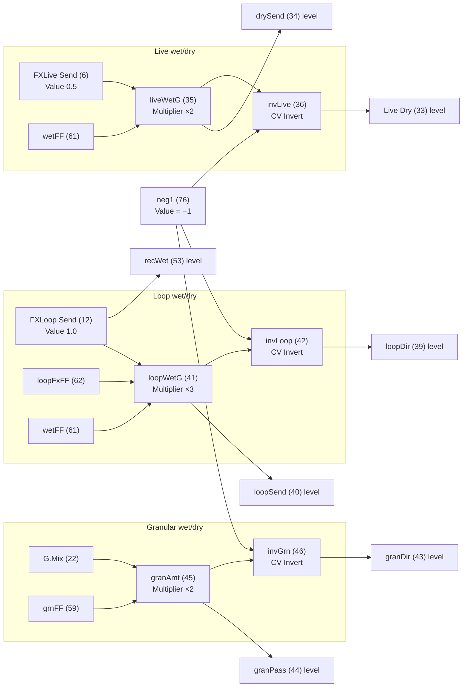
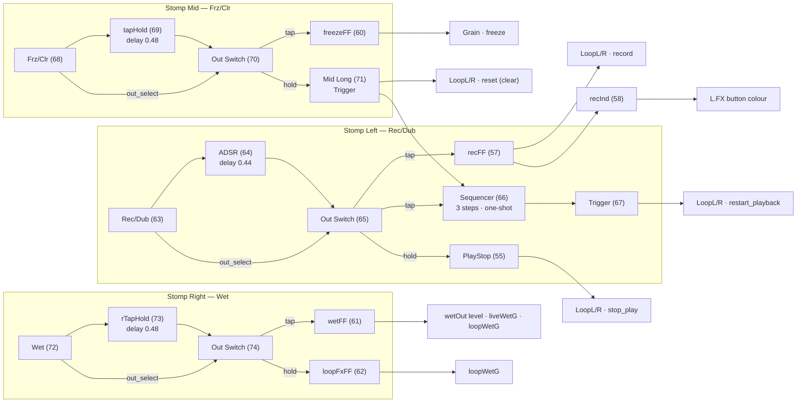

# The Magician — signal flow

Decoded from `The_Magician.bin` (77 modules, 132 connections, 11 pages, 58.81% CPU).
Node labels are `name (module #)`.

> Vue joueur (sans détails de modules) : `MAGICIAN_SIGNAL_PATH.md`

## 1. Audio path

Three things sum at the output: **live dry** (33), **loop dry** (39), **wet FX** (52).

## 2. Wet/dry crossfades (CV)

Every send/dry pair is a constant-power-ish crossfade: a Multiplier gates the
send level, and a `-1` offset + CV Invert produces `1 − send` for the dry leg.

Delay and Reverb bypass use the same offset trick on their **mix** input:
`mix = D.Mix + dlyFF − 1` (and `R.Mix + revFF − 1`), so mix collapses to fully
dry when the flip-flop is off.

## 3. Stomp control logic

Each stomp is momentary → ADSR (initial-delay acts as the tap/hold timer) →
Out Switch, routing short press to output 1 and long hold to output 2.

The `record → tap` path is the overdub-bypass hack: `recFF` toggles `record`
while the 3-step one-shot sequencer fires `Trigger (67)` into
`restart_playback`, so the first press records and subsequent presses overdub
without ever hitting a straight-to-overdub state.

## 4. Page 0 grid controls

| Row | Modules |
|---|---|
| Values (row 1) | D.FB, R.Decay, L.Start, G.Pos, G.Density |
| Values (row 2) | FXLive Send, D.Time, R.Low, L.Length, G.Size |
| Values (row 3) | FXLoop Send, D.Depth, R.High, L.Clock, G.Pitch |
| Values (row 4) | Volume, D.Mix, R.Mix, L.Level, G.Mix |
| Buttons | D.On, R.On, L.FX, G.On, L.RevL, L.RevR, G.Freeze, FX On |

UI Buttons are bidirectional: pressing one drives its flip-flop, and the
flip-flop feeds back into the button's `in` at strength ~70 for lighting, with
`OffCol (75) = 0.05` as the dim base colour.
