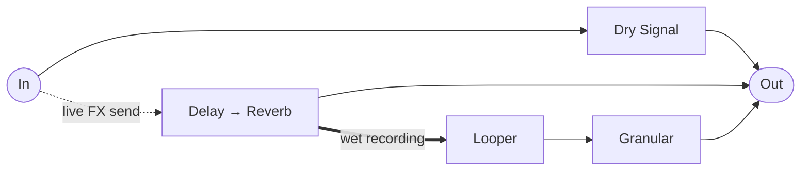
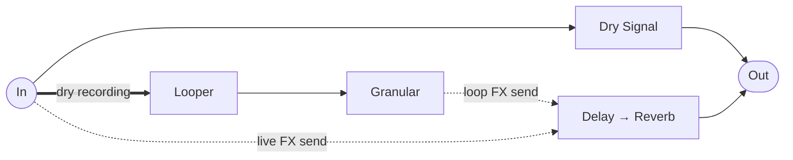

# The Magician — signal path

## L.FX OFF

```mermaid
flowchart LR
    IN(["In"])
    DRY["Dry Signal"]
    LOOP["Looper"]
    GRAIN["Granular"]
    FX["Delay → Reverb"]
    OUT(["Out"])

    IN --> DRY --> OUT
    IN -. "live FX send" .-> FX --> OUT
    FX == "wet recording" ==> LOOP
    LOOP --> GRAIN --> OUT
```

## L.FX ON

```mermaid
flowchart LR
    IN(["In"])
    DRY["Dry Signal"]
    LOOP["Looper"]
    GRAIN["Granular"]
    FX["Delay → Reverb"]
    OUT(["Out"])

    IN --> DRY --> OUT
    IN == "dry recording" ==> LOOP
    LOOP --> GRAIN -. "loop FX send" .-> FX
    IN -. "live FX send" .-> FX
    FX --> OUT
```
